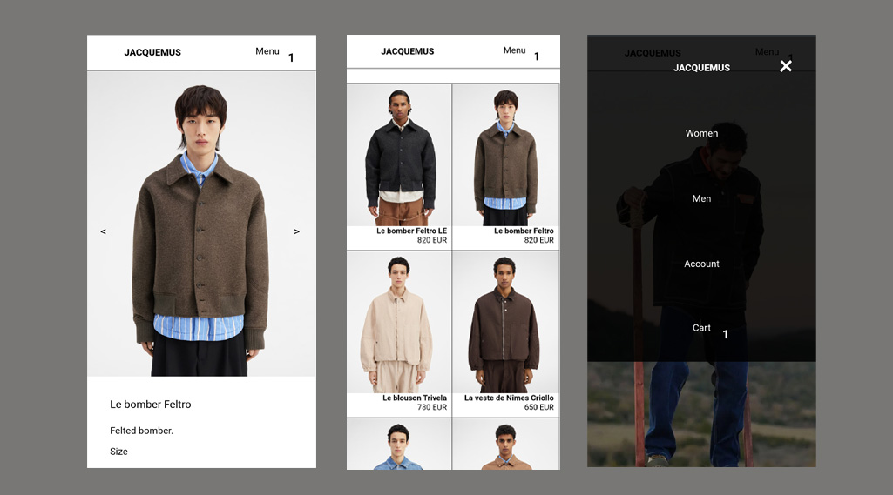
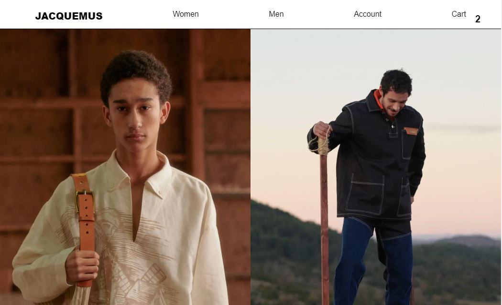
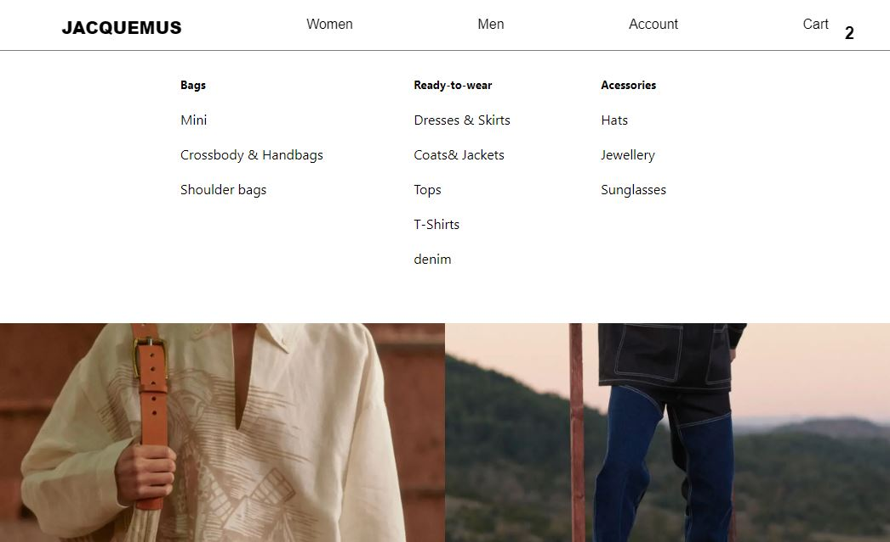
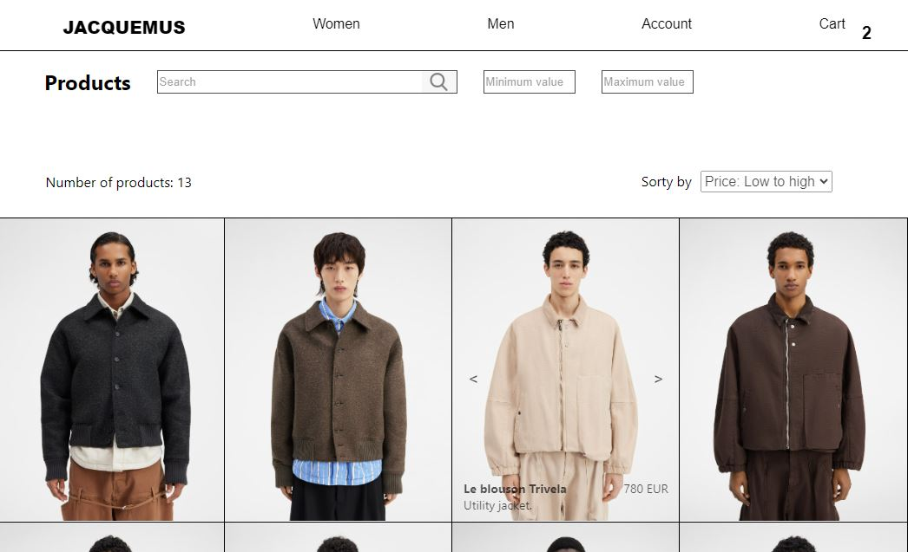
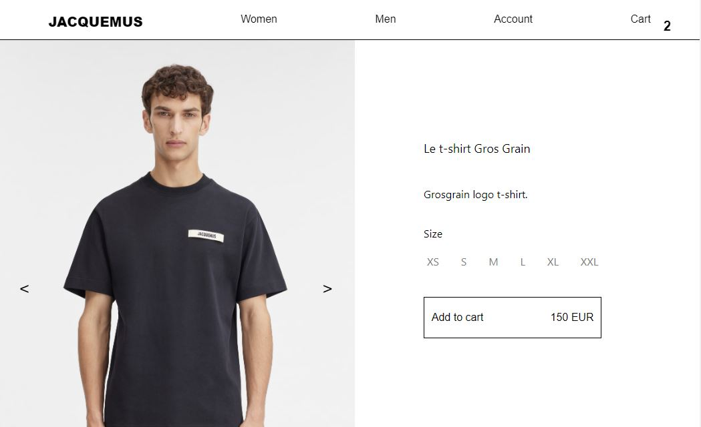
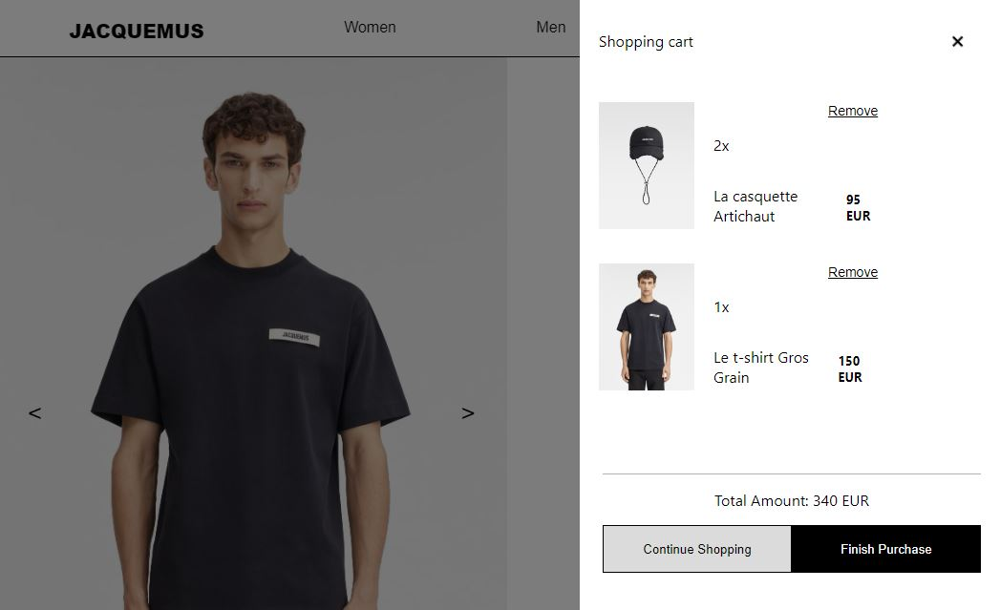

# [E-commerce](https://ecommercefrontend-ojoaoneiva.surge.sh/)

<p align="center">
  
</p>

## About:
The project consists on building the front-end of an E-Commerce platform that includes a shopping cart, search filters, product sorting, and its products are related to the theme of "space and galaxies".

## Functionalities:
- [x]  Products that can be sorted by price in ascending or descending order.
- [x]  Items are shown through search filters by name and minimum and maximum price.
- [x]  Function to add and remove products from the shopping cart, updating the total purchase value.
- [x]  Function to retain products in the shopping cart when the page is refreshed.

## Deploy:
https://ecommercefrontend-ojoaoneiva.surge.sh/

## How to run the project:
The app's front-end is already deployed, but if you want to run the project in your machine, follow these steps:

```bash
# Clone the project's repository:
    git clone https://github.com/ojoaoneiva/projeto-frontendreact.git

# Enter the front-end paste:
    cd template

# Install the app's dependencies:
    npm i

# Run the application:
    npm run start

# The server will start on localhost:3000
```

## Technologies used:
- React JS
- Props
- State
- List Rendering
- Conditional Rendering
- localStorage

## Images:

<p align="center">
    
    
    
    
    
    
</p>
